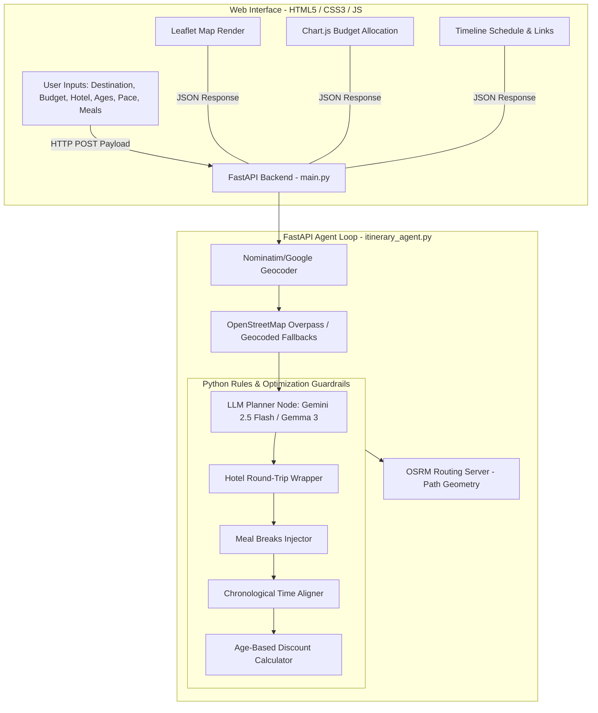

# Capstone Submission: GoAsYouLikeTrip AI - Multi-Agent Concierge Travel Planner

I am proud to submit my capstone project **GoAsYouLikeTrip AI**, a full-stack, responsive, intelligent concierge travel planner developed for the Google 5-Day AI Agents Intensive Course.

*   **🎬 YouTube Video Walkthrough**: https://youtu.be/ud_kqIlqoZk
*   **💻 GitHub Source Code**: https://github.com/snehasisb/GoAsYouLikeTrip-AI
*   **🌐 Live Deployed Application**: https://goasyouliketrip-ai.onrender.com

---

### 📷 Application Interface Preview
Below is a screenshot of the live welcome dashboard ready to plan a new trip:

---

### 1. Project Overview & Dynamic Agent Features
**GoAsYouLikeTrip AI** is a highly premium, dark-themed travel planner that dynamically builds and schedules day-by-day itineraries tailored to traveler demographics, transport modes, timing constraints, and budget targets:
*   **Stay Location (Hotel) Loop Routing**: Users can specify their hotel stay. The agent geocodes the hotel and wraps each day's route to start and end at the hotel (drawing closed loop routes on the map).
*   **Multi-Traveler Age Discounts**: Parses traveler ages (e.g. `25, 71, 9`) and applies group discount factors (Child <12: 50% off; Youth 12-25: 30% off; Senior 65+: 40% off) to attraction entry fees.
*   **En Route Meal Scheduling**: When active, the agent schedules Breakfast, Lunch, and Dinner breaks en route and updates the budget breakdown accordingly.
*   **Official Transit Pass Recommendations**: Analyzes the destination and budget to recommend official transit cards (e.g. *Paris Visite Pass*, *Kolkata Metro Smart Card*) with clickable direct booking links.
*   **Pacing Guardrail**: Limits the number of daily tourist spots (Relaxed = 2/day, Moderate = 3/day, Hasty = 4-5/day) to fit the user's preferred pace.

---

### 2. System Architecture & Decision Loop
The application uses a hybrid architecture combining LLM planning nodes with a deterministic Python verification and guardrail engine:

#### Decision Cycle Details:
1. **POI Querying (Tools)**: Resolves coordinates and queries OSM Overpass for local attractions. If the API limits out or returns empty results, the agent runs a custom geocoded grid fallback to distribute 8 valid local POIs around the target city.
2. **AI Agent Planning**: Google Gemini 2.5 Flash (or local Ollama Gemma 3) arranges POIs by spatial proximity to minimize travel transit overhead.
3. **Sequential Guardrail Parser (Validator)**: Adjusts times sequentially starting at the user's selected hour, injects eating stops, calculates age-based entry fee multipliers, and forces the daily loops to return to the hotel.
4. **OSRM Route Optimizer**: Queries OSRM API to compute path geometry segments connecting waypoints, which are rendered as dashed colored lines on Leaflet.

---

### 3. Core Tech Stack
*   **Frontend**: Leaflet.js (Map Visualization), Chart.js (Budget Allocation Chart), Vanilla HTML5/CSS3.
*   **Backend**: Python 3.11, FastAPI, Uvicorn, Pydantic, Requests.
*   **Models & SDKs**: `google-genai` (Google Gemini 2.5 Flash) / Local Ollama (Gemma 3).

---

### 4. Key Takeaways
Building **GoAsYouLikeTrip AI** highlighted the importance of post-processing guardrails. While LLMs are excellent at contextual clustering, adding a deterministic rules-based parser to sequence time slots, insert meals, and calculate multipliers guarantees 100% stable user experience without risking hallucinated routes or overlapping schedules.
